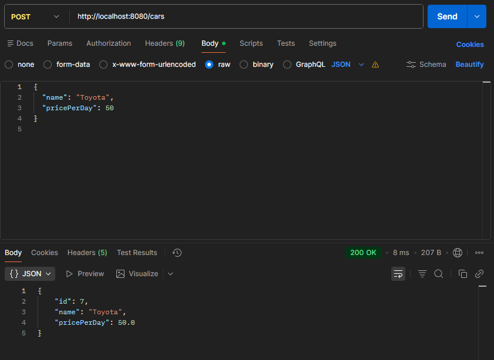
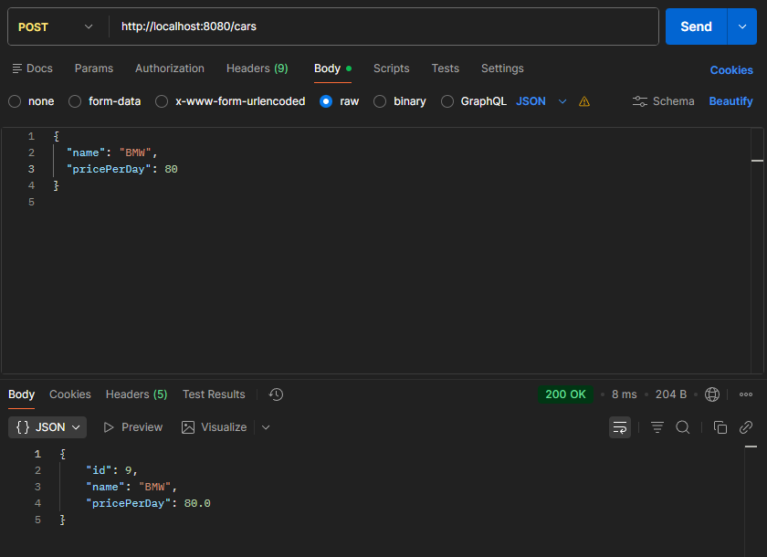
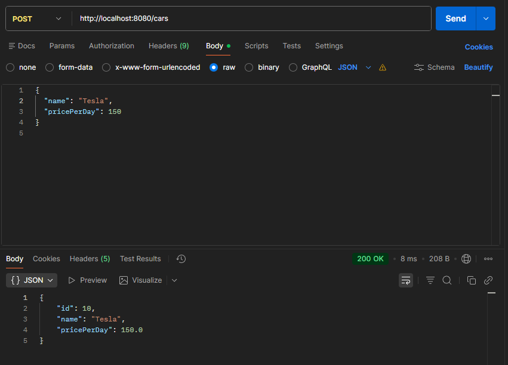
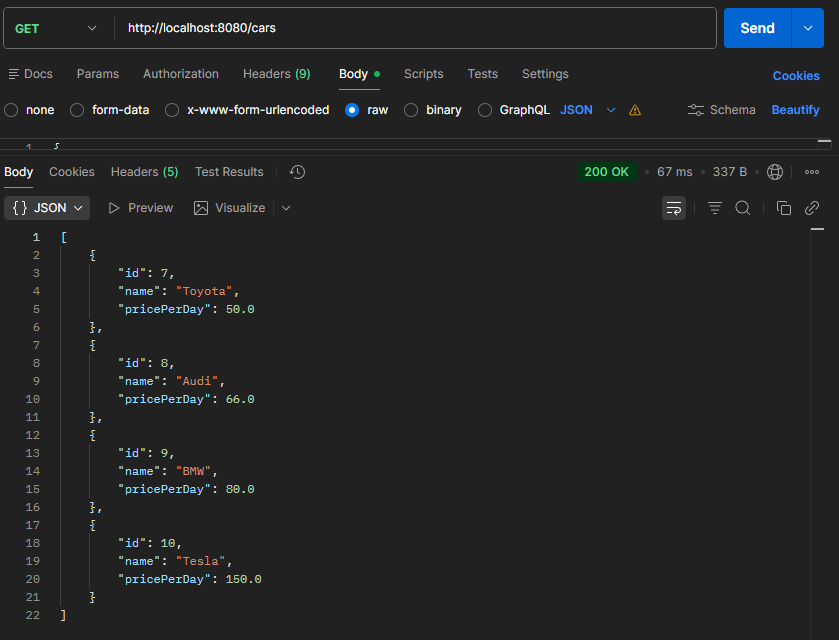
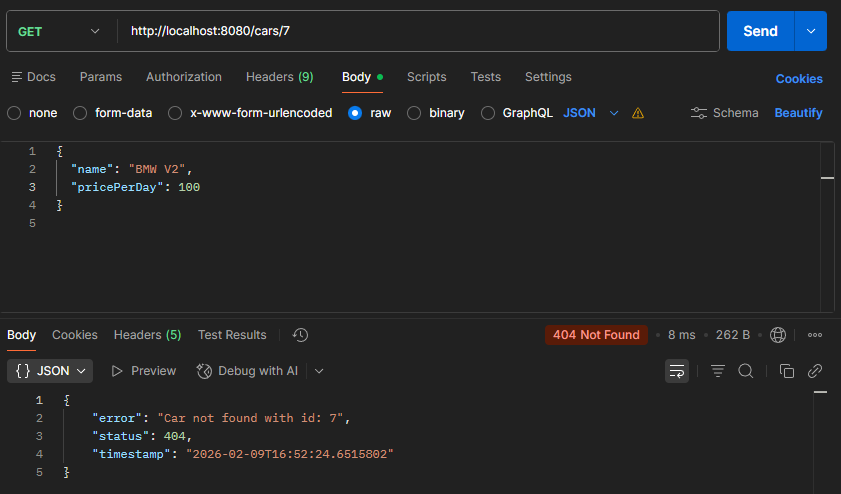

# Car Rental REST API

## A. Project Overview

This project is a Spring Boot RESTful application for a Car Rental System.  
It provides a backend API that allows managing cars, customers, and rentals using HTTP requests.

The application follows:
- REST architectural principles
- Layered architecture (control->service->repository)
- SOLID principles
- Spring Data JPA with PostgreSQL database

Technologies used:
- Java 25
- Spring Web
- Spring Data JPA
- Spring Boot 3.4.2
- PostgreSQL
- Maven
- Postman

## B. REST API documentation 

### URL

`http://localhost:8080`

### HTTP Methods

- GET to retrieve data
- POST to create new resources 
- PUT to update existing resources 
- DELETE delete resources 

### Car Endpoints

|Endpoint|HTTP Method|Description|
|-------|---|-----------|
|`/cars`|POST|Create a new car|
|`/cars`|GET|Get all cars |
|`/cars/id`|GET| Get car by ID|
|`/cars/id`|PUT| Update car|
|`/cars/id`|DELETE|Delete car|

---

## Create Cars (POST)

## Get all cars (GET)

## Update car (PUT)

## Delete car (DELETE)

Result:

## C. Design Patterns

### Singleton
- Used by Spring for services and repositories
- Ensures a single instance of each bean

### Factory
- Spring creates objects using Dependency Injection
- Controllers, Services, and Repositories are managed automatically

### Builder
- Used internally by Spring and Lombok (if applied)
- Simplifies object creation

## D. Component Principles

The application follows layered architecture:
- **Controller** – Handles HTTP requests
- **Service** – Contains business logic
- **Repository** – Handles database operations
- **DTO** – Transfers data between layers

Each component has a single responsibility.

---

## E. SOLID & OOP Summary

- **S** – Single Responsibility: each class has one role
- **O** – Open/Closed: easy to extend functionality
- **L** – Liskov Substitution: interfaces and inheritance used properly
- **I** – Interface Segregation: repositories use specific interfaces
- **D** – Dependency Inversion: services depend on abstractions

## G.  System Architecture 

Client ->  Architecture -> Service -> Service -> PostqreSQL DB

## H. Application running

### Prerequisites:
- Java 17+
- Maven
- PostgreSQL
- IntelliJ IDEA

### Steps:
1. Clone the repository
2. Configure `application.properties`
3. Run `CarrentalApplication`
4. Open Postman
5. Use `http://localhost:8080`